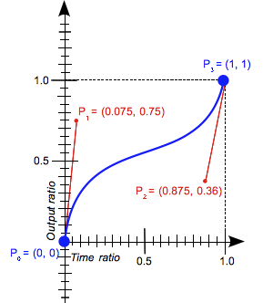

# 애플 인터랙티브 웹사이트 따라만들기

## 레퍼런스 사이트

[Apple iMac](https://www.apple.com/kr/imac-24/?afid=p238%7CswesbHzdy-dc_mtid_18707vxu38484_pcrid_660324231294_pgrid_130691116768_pntwk_g_pchan__pexid__&cid=aos-kr-kwgo-mac--slid---product-)
[Demo](https://nyanxyz.github.io/interactive-web-seminar/demo)

## CSS/JS로 구현하는 애니메이션

### 1. transform

- background-color, color, opacity, width, height

```css
transform: matrix(1.0, 2.0, 3.0, 4.0, 5.0, 6.0);
transform: matrix3d(1, 0, 0, 0, 0, 1, 0, 0, 0, 0, 1, 0, 0, 0, 0, 1);
transform: perspective(17px);
transform: rotate(0.5turn);
transform: rotate3d(1, 2.0, 3.0, 10deg);
transform: rotateX(10deg);
transform: rotateY(10deg);
transform: rotateZ(10deg);
transform: translate(12px, 50%);
transform: translate3d(12px, 50%, 3em);
transform: translateX(2em);
transform: translateY(3in);
transform: translateZ(2px);
transform: scale(2, 0.5);
transform: scale3d(2.5, 1.2, 0.3);
transform: scaleX(2);
transform: scaleY(0.5);
transform: scaleZ(0.3);
transform: skew(30deg, 20deg);
transform: skewX(30deg);
transform: skewY(1.07rad);
```

### 1.5. position

- static
- fixed
- relative, absolute, sticky


### 2. Transition

> **속성 변경이 즉시 영향을 미치게 하는 대신, 그 속성의 변화가 일정 기간에 걸쳐 일어나도록 할 수 있습니다.**
[MDN Docs](https://developer.mozilla.org/ko/docs/Web/CSS/CSS_Transitions/Using_CSS_transitions)
> 
- [애니메이션 가능한 속성의 집합](https://developer.mozilla.org/en-US/docs/Web/CSS/CSS_animated_properties)은 트랜지션 가능하다.

- transition은, 속성값의 변화가 Trigger

- transition-property
- transition-duration
- transition-timing-function
    - [Easing Functions Cheat Sheet](https://easings.net/)
    - cubic-bezier()
        
        
        
    - steps()
        
        
        
- transition-delay
- `transition: <property> <duration> <timing-function> <delay>;`

- property는 transform을 주로 활용하기

### 3. Animation

> **엘리먼트에 적용되는 CSS 스타일을 다른 CSS 스타일로 부드럽게 전환시켜 줍니다.
애니메이션은 애니메이션을 나타내는 CSS 스타일과 애니메이션의 중간 상태를 나타내는 키프레임들로 이루어집니다.**
[MDN Docs](https://developer.mozilla.org/ko/docs/Web/CSS/CSS_Animations/Using_CSS_animations)
> 

- animation은, 엘리먼트의 로드가 Trigger
- 중간 상태들이 부드럽게 이어지는 것

#### @keyframes

```css
@keyframes identifier {
  0% { top: 0; }
  50% { top: 30px; left: 20px; }
  100% { top: 0; }
}
```

- 0%: from, 100%: to 로도 지정 가능

#### animation

- animation-delay
- animation-direction
- animation-duration
- animation-iteration-count
    - infinite 지정 가능
- animation-name
    - @keyframes로 작성된 애니메이션의 중간 상태를 지정
- animation-play-state
    - running, paused로 멈추거나 시작 가능
- animation-timing-function
- animation-fill-mode
    - `forwards` 마지막 값을 유지
    - `backwards` 첫번째 값을 유지

[예제](https://www.w3schools.com/css/css3_animations.asp)

- rotate, x, background-color

```tsx
0% {
  background-color: olive;
  transform: rotate(0deg) translateX(0);
}

10% {
  background-color: green;
  transform: rotate(20deg) translateX(0);
}

50% {
  background-color: aqua;
	transform: ...
```

- 10%: 돌아가면서 배경색이 바뀐다
- 50%: 돌아간거 복구되면서 x값이 바뀐다
- 100%: 회전, x값, 배경색이 바뀐다

## Framer Motion

- React 라이브러리
- [Framer Motion Docs](https://www.framer.com/motion/introduction/)

- <motion.div>
- style, initial

### Animation

#### Enter animations

- 처음 로드될 때, style이나 initial과 animate 값이 다를 경우 애니메이션 시작
- initial에 false를 주어 enter animations를 비활성화 할 수 있음

#### Exit animations

- AnimatePresence 컴포넌트 사용

#### Keyframes

- animate 값을 array로 넘기기

### Transition

#### Tween

- duration-based animation
- properties
    - duration
    - ease
    - times

#### Spring

- simulates spring physics
- properties
    - duration (x)
    - bounce (x)
    - damping: 스프링을 멈추려는 힘의 세기, 0이면 멈추지 않음
    - mass: 물체의 질량
    - stiffness: 스프링의 강성
    - velocity
